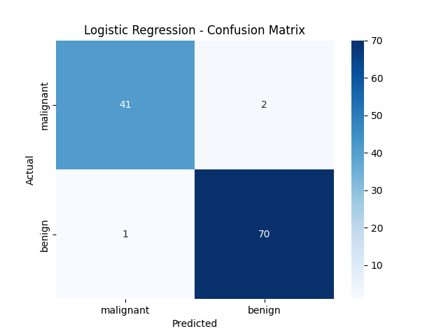
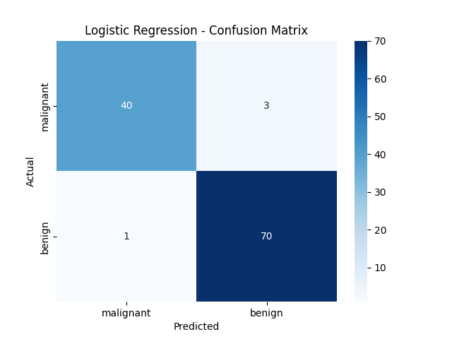

# Breast Cancer Prediction

Predict cancer with several model and compaire those

## Logistic Regression

Accuracy: 0.9736842105263158

Classification Report:

| Class        | Precision | Recall | F1-Score | Support |
|------------- |---------- |------- |--------- |-------- |
| 0            | 0.98      | 0.95   | 0.96     | 43      |
| 1            | 0.97      | 0.99   | 0.98     | 71      |
| **Accuracy** |           |        | 0.97     | 114     |
| **Macro Avg**| 0.97      | 0.97   | 0.97     | 114     |
| **Weighted Avg** | 0.97  | 0.97   | 0.97     | 114     |

## Random Forest Classifier

Accuracy: 0.9649122807017544

Classification Report:

| Class        | Precision | Recall | F1-Score | Support |
|------------- |---------- |------- |--------- |-------- |
| 0            | 0.98      | 0.93   | 0.95     | 43      |
| 1            | 0.96      | 0.99   | 0.97     | 71      |
| **Accuracy** |           |        | 0.96     | 114     |
| **Macro Avg**| 0.97      | 0.96   | 0.96     | 114     |
| **Weighted Avg** | 0.97  | 0.96   | 0.96     | 114     |

